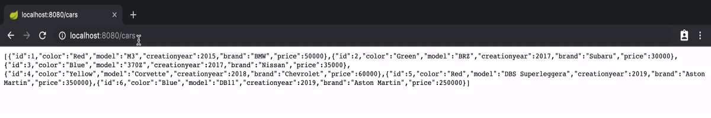
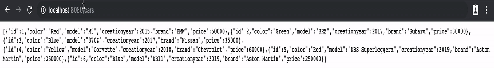
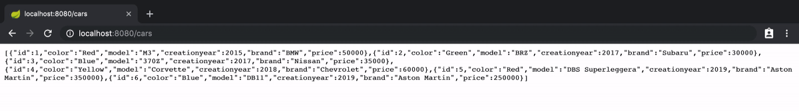
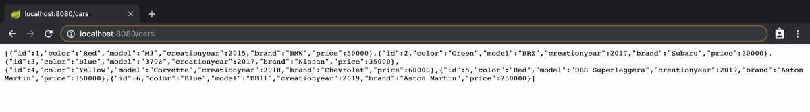
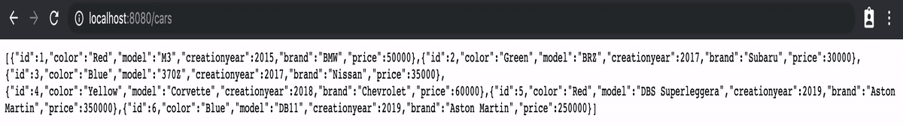
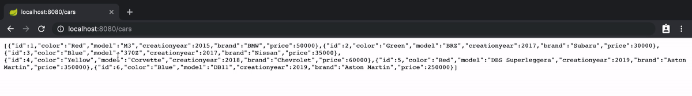
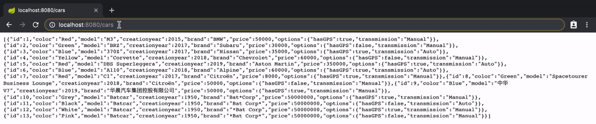
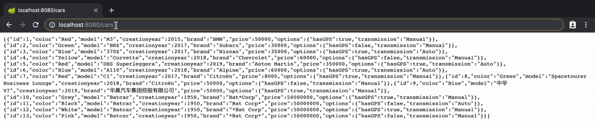
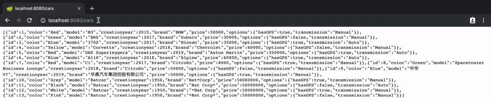
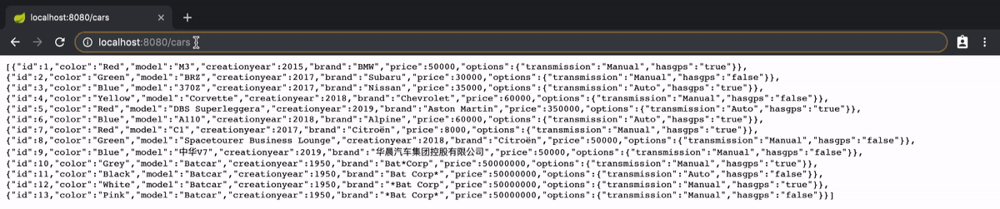

<!-- PROJECT SHIELDS -->
<!--
*** I'm using markdown "reference style" links for readability.
*** Reference links are enclosed in brackets [ ] instead of parentheses ( ).
*** See the bottom of this document for the declaration of the reference variables
*** for contributors-url, forks-url, etc. This is an optional, concise syntax you may use.
*** https://www.markdownguide.org/basic-syntax/#reference-style-links
-->
[![Contributors][contributors-shield]][contributors-url]
[![Forks][forks-shield]][forks-url]
[![Stargazers][stars-shield]][stars-url]
[![Issues][issues-shield]][issues-url]
[![MIT License][license-shield]][license-url]

[![codecov][coverage-shield]][coverage-url]

<!-- PROJECT LOGO -->
<br />
<p align="center">
  <a href="https://github.com/sipios/spring-search">
    
  </a>

  <h3 align="center">Spring Search</h3>

  <p align="center">
    Spring Search provides advanced search capabilities to a JPA entity
    <br />
    <a href="https://github.com/sipios/spring-search#installation"><strong>Explore the docs »</strong></a>
    <br />
    <br />
    <a href="https://github.com/sipios/spring-search#usage">View Demo</a>
    ·
    <a href="https://github.com/sipios/spring-search/issues">Report Bug</a>
    ·
    <a href="https://github.com/sipios/spring-search/issues">Request Feature</a>
  </p>
</p>


<!-- TABLE OF CONTENTS -->
## Table of Contents

* [About the Project](#about-the-project)
  * [Built With](#built-with)
* [Getting Started](#getting-started)
  * [Prerequisites](#prerequisites)
  * [Installation](#installation)
* [Usage](#usage)
* [Roadmap](#roadmap)
* [Contributing](#contributing)
* [License](#license)
* [Contact](#contact)
* [Acknowledgements](#acknowledgements)


<!-- ABOUT THE PROJECT -->
## About The Project

[![Spring-search screenshot][product-screenshot]](./docs/images/complex-example)

Spring Search provides a simple query language to perform advanced searches for your JPA entities.

Let's say you manage cars, and you want to allow API consumers to search for:
* Cars that are blue **and** that were created after year 2006 **or** whose model name contains "Vanquish"
* Cars whose brand is "Aston Martin" **or** whose price is more than 10000$

You could either create custom repository methods for both these operations, which works well if you know in advance which fields users might want to perform searches on. You could also use spring-search that allows searching on all fields, combining logical operators and much more.

Please note that providing such a feature on your API does not come without risks such as performance issues and less clear capabilities for your API. [This article](http://www.bizcoder.com/don-t-design-a-query-string-you-will-one-day-regret) summarizes these risks well.

### Built With

* [Kotlin](https://kotlinlang.org/)
* [Spring Boot](https://spring.io/projects/spring-boot)
* [ANTLR](https://www.antlr.org/)

<!-- GETTING STARTED -->
## Getting Started

**Requirements** : JDK 8 or more.  
To get a local copy up and running follow these simple steps.

### Installation
##### Maven

Add the repo to your project inside your `pom.xml` file
```xml
<dependency>
    <groupId>com.sipios</groupId>
    <artifactId>spring-search</artifactId>
    <version>0.2.0</version>
</dependency>
```

##### Gradle
Add the repo to your project by adding `implementation 'com.sipios:spring-search:0.2.0'` in your `build.gradle` file.

<!-- USAGE EXAMPLES -->
## Usage

Your repository should be annotated as a `RepositoryRestResource` and should extend `JpaSpecificationExecutor`
```kotlin
import org.springframework.data.jpa.repository.JpaRepository
import org.springframework.data.jpa.repository.JpaSpecificationExecutor
import org.springframework.data.rest.core.annotation.RepositoryRestResource

@RepositoryRestResource
interface YourRepository : JpaRepository<YourModel, Int>, JpaSpecificationExecutor<YourModel>
```

Import the library in your controller
```kotlin
import com.sipios.springsearch.anotation.SearchSpec
```

Use it in your controller
```kotlin
@GetMapping("searchUrl")
fun yourFunctionNameHere(@SearchSpec specs: Specification<YourModel>): ResponseEntity<List<YourResponse>> {
    return ResponseEntity(yourRepository.findAll(Specification.where(specs)), HttpStatus.OK)
}
```

1. Using the equal operator `:`  
Request : `/cars?search=color:Red`  


2. Using the not equal operator `!`  
Request : `/cars?search=color!Red`


3. Using the greater than operator `>`  
Request : `/cars?search=creationyear>2017`  


4. Using the less than operator `<`  
Request : `/cars?search=price<100000`  


5. Using the starts with operator `*`  
*For the ends with operator, simply place `*` at the beginning of the word*.  
*For the contains operator, simply place `*` at the beginning and the end of the word*.  
Request : `/cars?search=brand:Aston*`  


6. Using the `OR` operator  
Request : `/cars?search=color:Red OR color:Blue`  


7. Using the `AND` operator  
Request : `/cars?search=brand:Aston* AND price<300000`  


8. Using parenthesis  
Request : `/cars?search=( brand:Nissan OR brand:Chevrolet ) AND color:Blue`  
*Note: Spaces inside the parenthesis are not necessary*


9. Using space in nouns  
Request : `/cars?search=model:'Spacetourer Business Lounge'`  


10. Using special characters  
Request: `/cars?search=model:中华V7`


11. Using deep fields  
Request : `/cars?search=options.transmission:Auto`


12. Complex example  
Request : `/cars?search=creationyear:2018 AND price<300000 AND (color:Yellow OR color:Blue) AND options.transmission:Auto`


<!-- ROADMAP -->
## Roadmap

See the [open issues](https://github.com/sipios/spring-search/issues) for a list of proposed features (and known issues).

Please note that boolean parameter types are yet to be supported.


<!-- CONTRIBUTING -->
## Contributing

Contributions are what make the open source community such an amazing place to be learn, inspire, and create. Any contributions you make are **greatly appreciated**.

1. Fork the Project
2. Create your Feature Branch (`git checkout -b feature/AmazingFeature`)
3. Commit your Changes (`git commit -m 'Add some AmazingFeature'`)
4. Push to the Branch (`git push origin feature/AmazingFeature`)
5. Open a Pull Request


<!-- LICENSE -->
## License

Distributed under the MIT License. See `LICENSE` for more information.


<!-- CONTACT -->
## Contact

[@sipios_fintech](https://twitter.com/sipios_fintech) - contact@sipios.com

Project Link: [https://github.com/sipios/spring-search](https://github.com/sipios/spring-search)


<!-- MARKDOWN LINKS & IMAGES -->
<!-- https://www.markdownguide.org/basic-syntax/#reference-style-links -->
[contributors-shield]: https://img.shields.io/github/contributors/sipios/spring-search.svg?style=flat-square
[contributors-url]: https://github.com/sipios/spring-search/graphs/contributors
[forks-shield]: https://img.shields.io/github/forks/sipios/spring-search.svg?style=flat-square
[forks-url]: https://github.com/sipios/spring-search/network/members
[stars-shield]: https://img.shields.io/github/stars/sipios/spring-search.svg?style=flat-square
[stars-url]: https://github.com/sipios/spring-search/stargazers
[issues-shield]: https://img.shields.io/github/issues/sipios/spring-search.svg?style=flat-square
[issues-url]: https://github.com/sipios/spring-search/issues
[license-shield]: https://img.shields.io/github/license/sipios/spring-search.svg?style=flat-square
[license-url]: https://github.com/sipios/spring-search/blob/master/LICENSE.txt
[product-screenshot]: docs/images/complex-example.gif
[coverage-shield]: https://codecov.io/gh/sipios/spring-search/branch/master/graph/badge.svg
[coverage-url]: https://codecov.io/gh/sipios/spring-search
